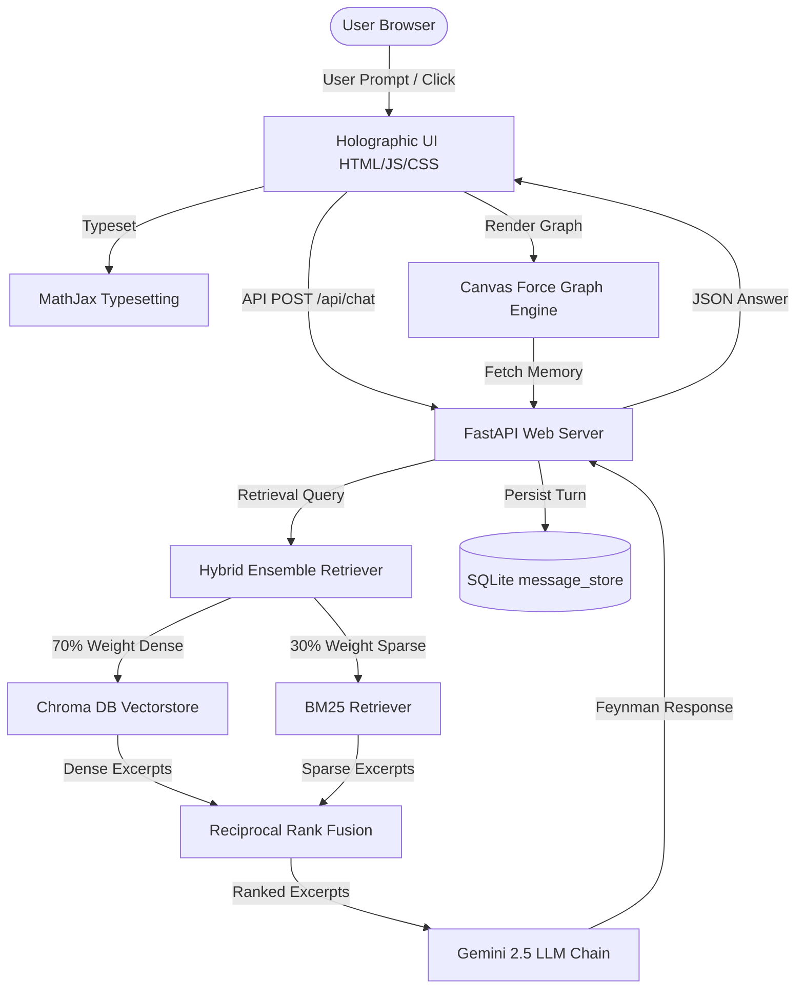

# System Design & Architecture Documentation: Dr. Richard Feynman Digital Twin

This document outlines the technical approach, architectural layout, and critical design decisions made during the development of the RAG-backed digital twin of Nobel laureate physicist Dr. Richard Feynman.

---

## 1. Project Goal & Overview
The objective is to construct an immersive, interactive web application acting as a digital twin of Richard Feynman. It serves as an educational companion for university students tackling advanced concepts in physics, mathematics, electrical engineering, and computing. 

Rather than a generic assistant, the agent is designed to embody Feynman's signature voice, pedagogical style (the "Feynman Technique"), intellectual honesty, safe-cracking humor, and infectious curiosity.

---

## 2. Technical Stack
The application is designed to be lightweight, zero-dependency on the frontend, fast, and robust:
*   **Frontend UI:** Vanilla HTML5, CSS3, and JavaScript. 
    *   *Typography:* Google Fonts "Outfit" (geometric sans-serif) and "JetBrains Mono" (code blocks).
    *   *Icons:* FontAwesome v6.
    *   *Math Typesetting:* MathJax v3 CDN with dynamic typeset triggers.
*   **Backend Server:** FastAPI (Python 3.11/3.12) running under Uvicorn.
*   **AI & RAG Pipeline:** LangChain (combining classic retrieval chains with community database integrations) and Google Gemini API (`gemini-2.5-flash` LLM, `text-embedding-004` embedding model).
*   **Database & Persistence:** SQLite for local stateful dialogue memory and Chroma DB as the dense vector index.

---

## 3. Architecture & Data Flow

---

## 4. Key Design Decisions

### A. RAG Hybrid Retrieval Strategy
To deliver grounding in Feynman's actual publications, lectures, and transcripts, we implemented a hybrid RAG retrieval pipeline:
1.  **Dense Retrieval (70%):** Chroma vector store queries are processed using Google Generative AI embeddings (`text-embedding-004`). This captures semantic meanings, synonyms, and conceptual relationships.
2.  **Sparse Retrieval (30%):** `BM25Retriever` performs keyword frequency matching. This ensures that exact mathematical equations, physics symbols, proper names, and literal terms are retrieved accurately.
3.  **Fusion:** The retrievers are fused using LangChain's `EnsembleRetriever` which balances semantic mapping and strict term matching. This mitigates hallucination and ensures responses are deeply grounded in real lecture transcripts.

### B. Local NLP Memory Extractor
Instead of invoking the LLM to summarize or classify user memories (which incurs token fees, latency, and rate limits), we implemented `MemoryExtractor` inside `memory_extractor.py`:
*   **Heuristics Matcher:** Matches text against pre-defined regexes covering core Feynman topics (e.g. QED, nanotech, safecracking).
*   **Named Entity Discoverer:** Dynamically extracts multi-word capitalized phrases (excluding common sentence starters) to harvest organic concepts like "Dirac Equation" or "Schrödinger."
*   **Linking:** Connects concepts discussed in the same conversational exchange to draw semantic threads.
*   **Milestones:** Traces the first time a concept is introduced to build an educational timeline of their study path.

### C. Custom Force-Directed Graph Engine
To provide a premium visualization of long-term memory:
*   Built a custom, zero-dependency physics loop inside `script.js` running on an HTML5 `<canvas>`.
*   **Coulomb's Repulsion:** $F_r = \frac{k_r}{d^2}$ pushes nodes apart.
*   **Hooke's Spring Tension:** $F_a = k_a \cdot (d - d_0)$ pulls linked concepts together.
*   **Damping & Friction:** Velocity multiplier of $0.8$ ensures physics simulations converge quickly to stable layouts.
*   **Memory Pulses:** Draws glowing particle nodes drifting continuously along connection lines, symbolizing active neural signals.
*   **Recall Connection:** Clicking a node queries the local extraction database, opening a "Recall Chamber" of past dialog bubbles matching the concept.

### D. MathJax LaTeX Typesetting
To present equations in high academic quality:
*   Integrated MathJax v3, allowing text formulas like `$E = mc^2$` or display systems like `$$\psi(x,t)$$` to be parsed.
*   Configured an post-append promise chain in `script.js`: `MathJax.typesetPromise([msgDiv])`. Whenever a new message bubble lands, it specifically compiles only that div, preserving rendering speed and avoiding full-page re-typesets.

### E. Incognito Browser Protection
Accessing `localStorage` throws a fatal `SecurityError` in incognito tabs or iframe contexts on modern browsers:
*   **The Fix:** Wrapped all `localStorage.getItem` and `localStorage.setItem` inside `try-catch` blocks. If blocked, the application automatically handles sessions in-memory, preventing script failure and keeping forms responsive.
*   **ReadyState Check:** Uses `document.readyState` check to instantly initialize script hooks in cases where the document completed loading before script execution.

---

## 5. Directory Mapping & Repository Policies

*   **`static/`**: Clean separation of frontend scripts. Contains `index.html` (structure), `script.js` (UI logic, canvas engines, animations), and `style.css` (retro-futuristic styling tokens).
*   **`feynman_memory.db`**: Local SQLite database storing conversational session history.
*   **`feynman_twin_db/`**: Local cache directories hosting vector embeddings database.
*   **`.gitignore`**: Strictly ignores local binaries, DB caches, logs, credentials (`.env`), and python environments (`.venv/`) to maintain repository hygiene.
